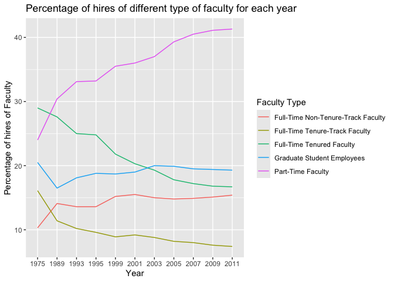
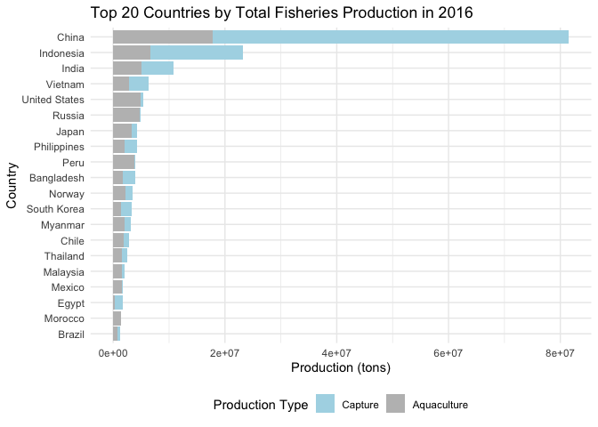
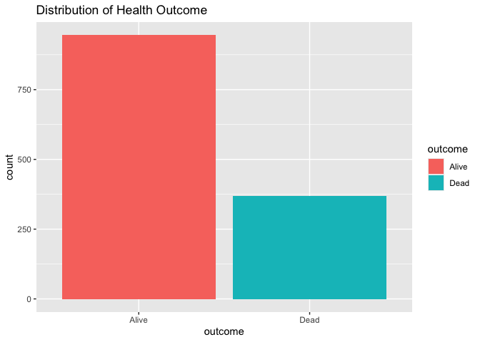
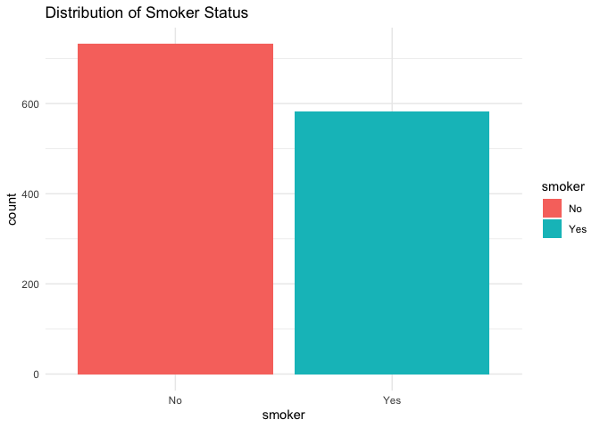
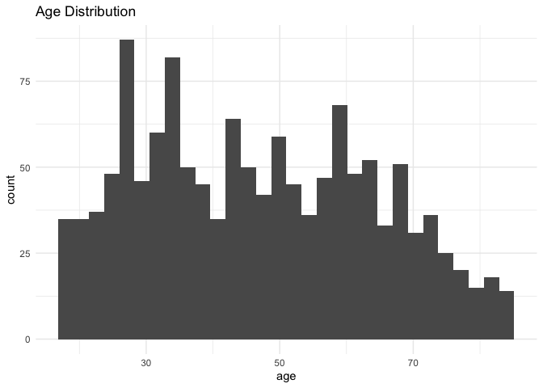
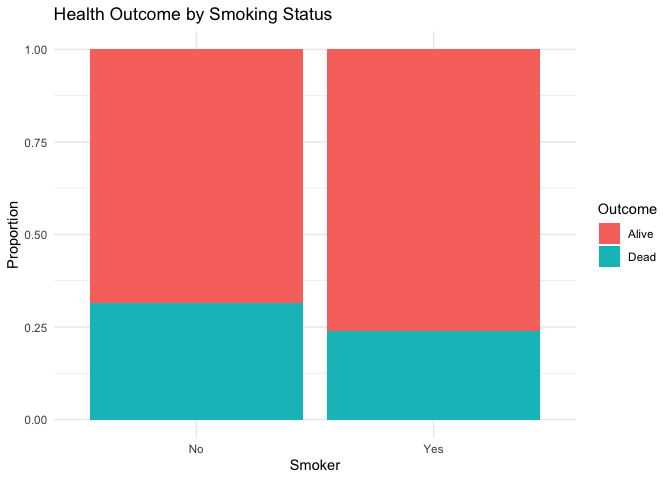
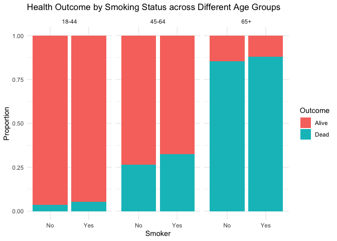

Lab 06 - Ugly charts and Simpson’s paradox
================
Barbara Mu
02/18/2026

### Load packages and data

``` r
library(tidyverse) 
library(dsbox)
library(mosaicData) 
```

``` r
library(usethis)
use_git_config(
  user.name = "Your Name",
  user.email = "your.email@address.com"
)
```

``` r
staff <- read_csv("data/instructional-staff.csv")
```

    ## Rows: 5 Columns: 12
    ## ── Column specification ────────────────────────────────────────────────────────
    ## Delimiter: ","
    ## chr  (1): faculty_type
    ## dbl (11): 1975, 1989, 1993, 1995, 1999, 2001, 2003, 2005, 2007, 2009, 2011
    ## 
    ## ℹ Use `spec()` to retrieve the full column specification for this data.
    ## ℹ Specify the column types or set `show_col_types = FALSE` to quiet this message.

``` r
staff_long <- staff %>%
  pivot_longer(cols = -faculty_type, names_to = "year") %>%
  mutate(value = as.numeric(value))
staff_long
```

    ## # A tibble: 55 × 3
    ##    faculty_type              year  value
    ##    <chr>                     <chr> <dbl>
    ##  1 Full-Time Tenured Faculty 1975   29  
    ##  2 Full-Time Tenured Faculty 1989   27.6
    ##  3 Full-Time Tenured Faculty 1993   25  
    ##  4 Full-Time Tenured Faculty 1995   24.8
    ##  5 Full-Time Tenured Faculty 1999   21.8
    ##  6 Full-Time Tenured Faculty 2001   20.3
    ##  7 Full-Time Tenured Faculty 2003   19.3
    ##  8 Full-Time Tenured Faculty 2005   17.8
    ##  9 Full-Time Tenured Faculty 2007   17.2
    ## 10 Full-Time Tenured Faculty 2009   16.8
    ## # ℹ 45 more rows

``` r
staff_long %>%
  ggplot(aes(x = year, y = value, color = faculty_type)) +
  geom_line()
```

    ## `geom_line()`: Each group consists of only one observation.
    ## ℹ Do you need to adjust the group aesthetic?

<!-- -->

``` r
staff_long %>%
  ggplot(aes(
    x = year,
    y = value,
    group = faculty_type,
    color = faculty_type
  )) +
  geom_line()
```

<!-- -->

### Exercise 1 - Instructional staff employment trends

``` r
staff_long %>%
  ggplot(aes(
    x = year,
    y = value,
    group = faculty_type,
    color = faculty_type
  )) +
  geom_line() + 
  labs(
    title = "Percentage of hires of different type of faculty for each year",
    x = "Year",
    y = "Percentage of hires of Faculty", 
    ) + 
  guides(color = guide_legend(title = "Faculty Type"))
```

<!-- -->

### Exercise 2 - Instructional staff employment trends

I will assign Part-Time Faculty a more obvious color and bold it.

### Exercise 3 - Fisheries

The two plots both didn’t effectively communicate fisheries production
data for several reasons. First, the 3D pie chart makes it’s impossible
to accurately compare production magnitudes across countries.
Compounding this issue, both plots include far too many countries,
creating visual clutter that overwhelms the readers. Second, the bar
plot’s x-axis range extends to 90 milion tons, which is driven entirely
by China, causing most other countries’ bars to appear nearly
indistinguishable from zero and rendering meaningful comparison
impossible. Third, the bar plot’s legend is missing labels, leaving the
readers unable to determine which color corresponds to capture fishing
or aquaculture.

``` r
fisheries <- read_csv("data/fisheries.csv")
```

    ## Rows: 216 Columns: 4
    ## ── Column specification ────────────────────────────────────────────────────────
    ## Delimiter: ","
    ## chr (1): country
    ## dbl (3): capture, aquaculture, total
    ## 
    ## ℹ Use `spec()` to retrieve the full column specification for this data.
    ## ℹ Specify the column types or set `show_col_types = FALSE` to quiet this message.

``` r
fisheries_long <- fisheries %>% 
  filter(total > 100000) %>% 
  pivot_longer(cols = c(capture, aquaculture), 
               names_to = "type", values_to = "tons")
```

``` r
# Show top 20 countries to keep it readable
top_countries <- fisheries %>%
  filter(total > 100000) %>%
  slice_max(total, n = 20) %>%
  pull(country)
top_countries
```

    ##  [1] "China"         "Indonesia"     "India"         "Vietnam"      
    ##  [5] "United States" "Russia"        "Japan"         "Philippines"  
    ##  [9] "Peru"          "Bangladesh"    "Norway"        "South Korea"  
    ## [13] "Myanmar"       "Chile"         "Thailand"      "Malaysia"     
    ## [17] "Mexico"        "Egypt"         "Morocco"       "Brazil"

``` r
fisheries_long %>% 
  filter(country %in% top_countries) %>% 
  ggplot(aes(x = tons, y = fct_reorder(country, tons, sum), fill = type)) + 
  geom_col() + 
  scale_fill_manual(
    values = c("capture" = "gray", "aquaculture" = "lightblue"),
    labels = c("Capture", "Aquaculture")
  ) +
  labs(
    title = "Top 20 Countries by Total Fisheries Production in 2016",
    x = "Production (tons)",
    y = "Country",
    fill = "Production Type") +
  theme_minimal() +
  theme(legend.position = "bottom")
```

<!-- -->

### Whickham

``` r
library(tidyverse)
library(mosaicData)
```

``` r
data(Whickham)
```

``` r
?Whickham
library(performance)
#performance::compare_performance() # might not be behaving as intented.
```

### Exercise 1

I think it is from an observational study because participants were not
randomly assigned to smoke or not. Smoking status was recorded as it
naturally occurred.

### Exercise 2

There are 1314 observations, each representing individual participant.

### Exercise 3

There are 3 variables - `outcome`, `smoker`, `age`.

``` r
ggplot(Whickham, aes(x = outcome, fill = outcome)) + 
  geom_bar() + 
  labs(title = "Distribution of Health Outcome")
```

<!-- -->

``` r
ggplot(Whickham, aes(x = smoker, fill = smoker)) +
  geom_bar() + theme_minimal() + labs(title = "Distribution of Smoker Status")
```

<!-- -->

``` r
ggplot(Whickham, aes(x = age)) +
  geom_histogram() +
  theme_minimal() + labs(title = "Age Distribution")
```

    ## `stat_bin()` using `bins = 30`. Pick better value `binwidth`.

<!-- -->

### Exercise 4

We expect smokers to have worse health outcomes.

### Exercise 5

``` r
Whickham %>%
  count(smoker, outcome) %>% 
  group_by(smoker) %>% 
  mutate(prop = n / sum(n)) %>% 
  ggplot(aes(x = smoker, y = prop, fill = outcome)) + 
  geom_col() +
  labs(title = "Health Outcome by Smoking Status",
    x = "Smoker", y = "Proportion", fill = "Outcome") +
  theme_minimal()
```

<!-- -->

### Exercise 6

``` r
Whickham <- Whickham %>%
  mutate(age_cat = case_when(
    age <= 44 ~ "18-44",
    age > 44 & age <= 64 ~ "45-64",
    age > 64 ~ "65+"
  ))
```

### Exercise 7

``` r
Whickham %>% 
count(smoker, age_cat, outcome) %>% 
  group_by(smoker, age_cat) %>% 
  mutate(prop = n / sum(n)) %>% 
  ggplot(aes(x = smoker, y = prop, fill = outcome)) + 
  geom_col() +
  facet_wrap(~age_cat) +
  labs(title = "Health Outcome by Smoking Status across Different Age Groups",
    x = "Smoker", y = "Proportion", fill = "Outcome") +
  theme_minimal()
```

<!-- -->

The results we got is reversed - smoker have worse outcomes than
non-smokers of the same age. This reversed results indicates that an
aggregate trend disappears or reverses when data are broken down by
another variable, like age here. Age masked the true relationship
between smoking and health outcomes in the analysis, and only by
controlling for age we could recover the true patterns.
